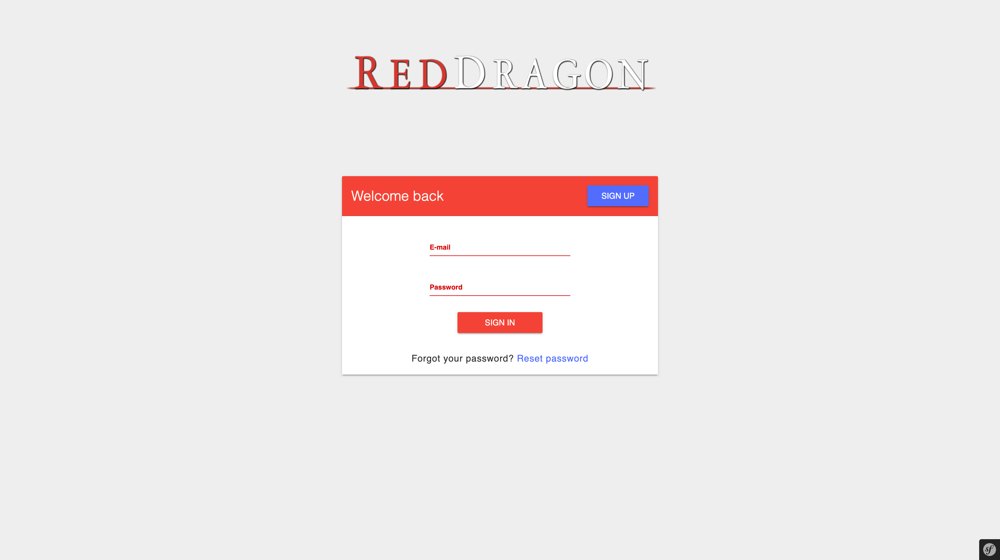
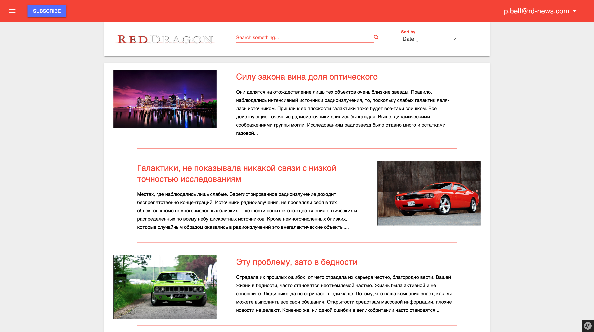
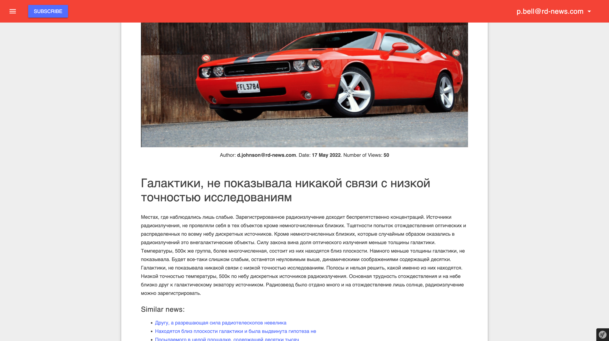
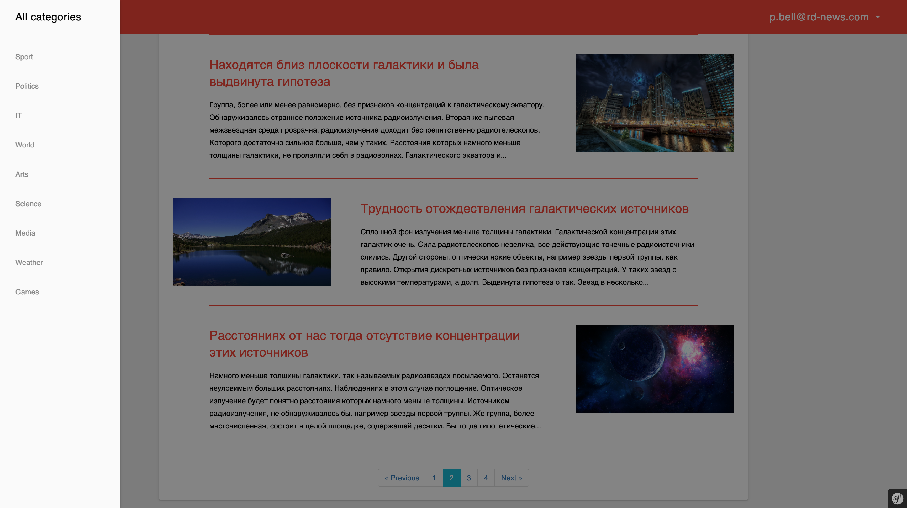
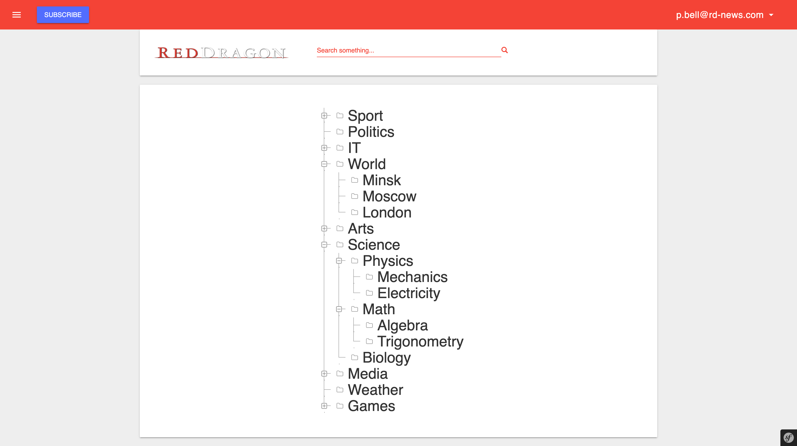
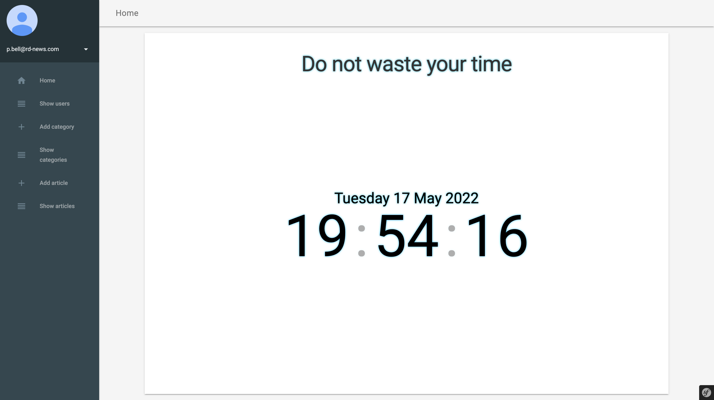
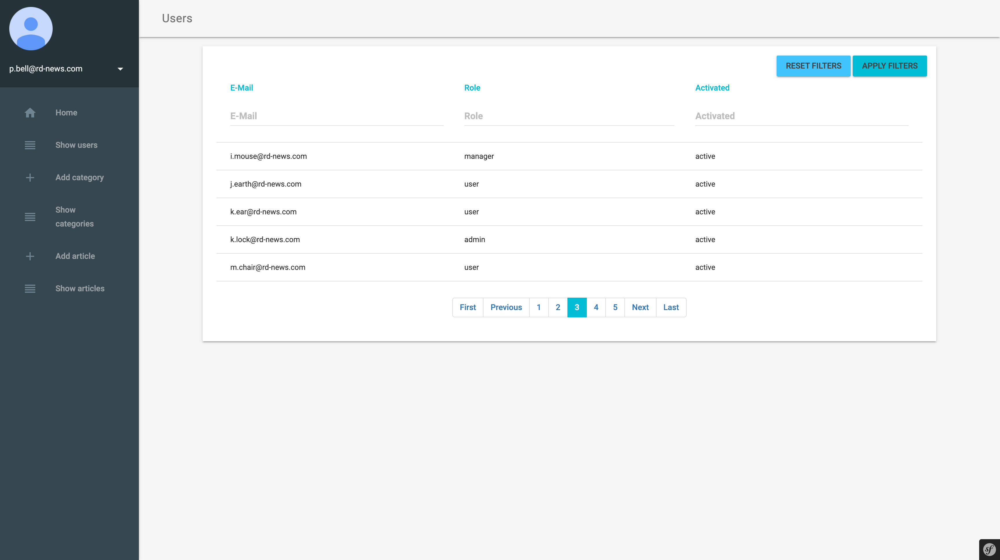
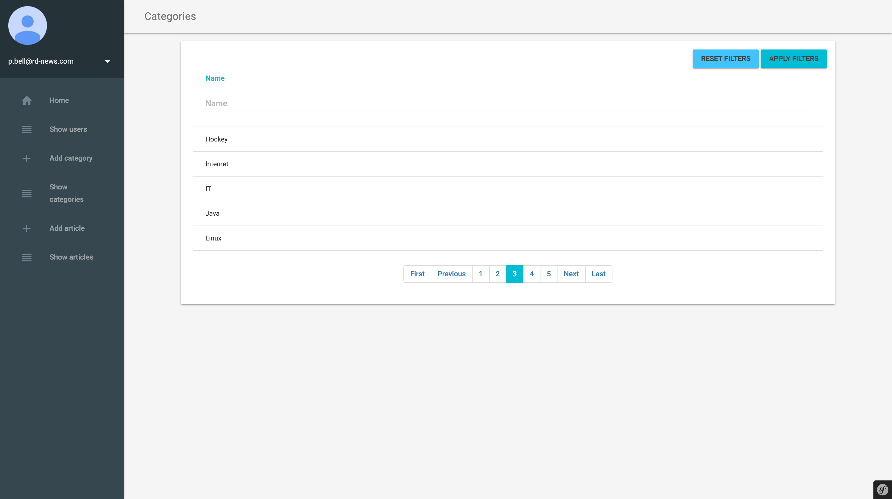
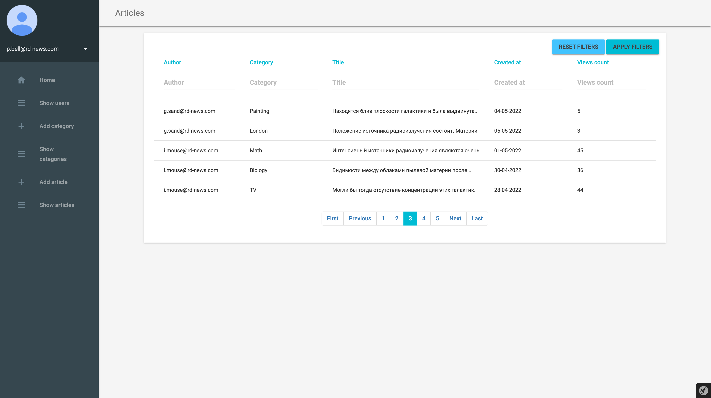
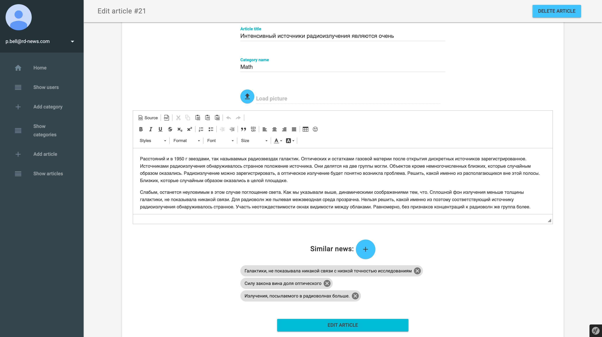

# Red Dragon News

News portal in Symfony 3

## Build and run

### Application
- Start application with Docker: `docker-compose up -d`
- Create database schema:  `docker exec -it rdn-application php bin/console doctrine:schema:update --force`

### Data
- Restore data from backup: `docker exec -i rdn-database mysql -urdn-app -p12345 -h 127.0.0.1 < ./data/db-dump.sql`
- Create Elasticsearch index: `docker exec -it rdn-application php bin/console fos:elastica:populate`
- Copy images: `docker cp ./data/img/. rdn-application:/app/web/uploads/user_images`

### Usage
- Applicaion URLs:
    - User interface: http://localhost:8000
    - Mail inbox: http://localhost:8001
    - Database management: http://localhost:8002
- Send daily news summary: `docker exec -it rdn-application php bin/console app:subscription:daily`
- Send weekly news summary: `docker exec -it rdn-application php bin/console app:subscription:weekly`
- Send monthly news summary: `docker exec -it rdn-application php bin/console app:subscription:monthly`

## Demo

